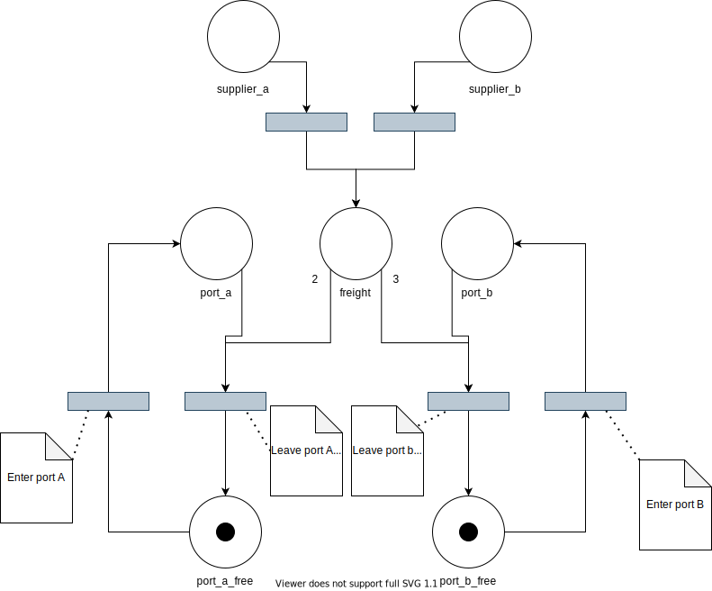

# Simple PTN Examples

## Harbor Terminals

A little Harbor with two Ports (A and B)
will load freights from a common freight depot to ships in Port A and B. Due to the limitation of the canals, there can only be one ship in each port simultaneously.
The common freight depot is filled at arbitrary rates.
Ships on port A will leave only with 2 freights, whereas ships on
port B will only leave with 3 freights.
Initially both ports are free.

Triggers:
- The arrival and leaving of Ships will be triggered externally
- The suppliers can be enabled and supply as soon, as they can


### Sketching the Net

The example Software is based on the following Petri Net:



### Implement the Net

First we create a Wrapper to encapsulate the PetriNet.
Because Suppliers will be added arbitrarily, the
PortNetManager will only contain the freight and port net.

```c++
class PortNetManager {
private:
  sptn::PetriNet<> net_;

public:
  PortNetManager() {}
};
```

Next we add the places.

```c++
class PortNetManager {
private:
  sptn::PetriNet<> net_;

public:
  PortNetManager() {
    // no ship in port a
    net_.addPlace("port_a", 0);
    net_.addPlace("port_a_free", 1);

    // no ship in port b
    net_.addPlace("port_b", 0);
    net_.addPlace("port_b_free", 1);

    // Initially no freight to load
    net_.addPlace("freight", 0);
  }
};
```

For the Transitions we first create some TransitionSketches and then
add them to the net.

```c++
class PortNetManager {
private:
  sptn::PetriNet<> net_;

public:
  PortNetManager() {
    // no ship in port a
    net_.addPlace("port_a", 0);
    net_.addPlace("port_a_free", 1);

    // no ship in port b
    net_.addPlace("port_b", 0);
    net_.addPlace("port_b_free", 1);

    // Initially no freight to load
    net_.addPlace("freight", 0);

    // Enter/leave transitions
    sptn::PetriNet<>::TransitionSketch enter_a = {"enter_a", {{"port_a_free", 1}}, {{"port_a", 1}}};
    sptn::PetriNet<>::TransitionSketch enter_b = {"enter_b", {{"port_b_free", 1}}, {{"port_b", 1}}};
    sptn::PetriNet<>::TransitionSketch leave_a = {
        "leave_a", {{"port_a", 1}, {"freight", 2}}, {{"port_a_free", 1}}};
    sptn::PetriNet<>::TransitionSketch leave_b = {
        "leave_b", {{"port_b", 1}, {"freight", 3}}, {{"port_b_free", 1}}};

    // add sketches
    net_.addTransition(enter_a);
    net_.addTransition(enter_b);
    net_.addTransition(leave_a);
    net_.addTransition(leave_b);

  }
};
```

In this example the arrival and leaving of ships will be triggered
externally, to provide easier access we will save local pointers
to the actual Transition objects.

```c++
class PortNetManager {
private:
  sptn::PetriNet<> net_;

  // Important elements of the net (we want to manually fire those)
  std::shared_ptr<sptn::PetriNet<>::TransitionT> enter_a_;
  std::shared_ptr<sptn::PetriNet<>::TransitionT> enter_b_;
  std::shared_ptr<sptn::PetriNet<>::TransitionT> leave_a_;
  std::shared_ptr<sptn::PetriNet<>::TransitionT> leave_b_;

public:
  PortNetManager() {
    // ...

    // Get a reference to the real transitions (for easier access)
    this->enter_a_ = net_.findTransition("enter_a");
    this->enter_b_ = net_.findTransition("enter_b");
    this->leave_a_ = net_.findTransition("leave_a");
    this->leave_b_ = net_.findTransition("leave_b");
  }
};
```

Now the net itself is ready, we only need to make it available
to the outside. try{Enter,Leave}{A,B} tries to fire the corresponding transition
and returns true if it succeeded. can{Enter,Leave}{A,B} checks if the
matching try.. function will succeed. We will need tick() later
to auto fire the suppliers.

```c++
class PortNetManager {

  // ...

public:
  bool tryEnterA() { return this->enter_a_->fire(); }
  bool tryEnterB() { return this->enter_b_->fire(); }
  bool tryLeaveA() { return this->leave_a_->fire(); }
  bool tryLeaveB() { return this->leave_b_->fire(); }
  bool canEnterA() { return this->enter_a_->ready(); }
  bool canEnterB() { return this->enter_b_->ready(); }
  bool canLeaveA() { return this->leave_a_->ready(); }
  bool canLeaveB() { return this->leave_b_->ready(); }

  void tick() { this->net_.tick(); }
};
```

For the extension of the Net with suppliers, we will introduce a new
abstract class Supplier:


```c++
class Supplier {
public:
  virtual void attachToNet(sptn::PetriNet<> &net) = 0;
};

class PortNetManager {
public:
  // ...
  void addSupplier(Supplier &supplier) { supplier.attachToNet(this->net_); }
};
```

Suppliers will attach themselves to an existing net with a "freight" place.


A derived Supplier with a total amount of freights to deliver and 
a number of freights to deliver will look like this.

```c++
class Supplier {
template <uint32_t amount, uint32_t per_tick> class EnabledSupplier : public Supplier {
private:
  bool enabled_;

public:
  EnabledSupplier() : enabled_(false) {}

  void enable() { this->enabled_ = true; }
  void disable() { this->enabled_ = false; }
};
```

Next we implement the attachToNet method.


```c++
template <uint32_t amount, uint32_t per_tick> class EnabledSupplier : public Supplier {
private:
  bool enabled_;

public:
  EnabledSupplier() : enabled_(false) {}

  virtual void attachToNet(sptn::PetriNet<> &main_net) override {
    // Generate name
    std::ostringstream oss;
    oss << amount << "@" << per_tick;
    std::string suffix = oss.str();
    std::string place_name = "supplier_stock_" + suffix;
    std::string transition_name = "supply_" + suffix;

    // add supplier stock
    main_net.addPlace(place_name, amount);

    // move per_tick from supplierstock to freight
    sptn::PetriNet<>::TransitionSketch supply{
        transition_name, {{place_name, per_tick}}, {{"freight", per_tick}}};
    main_net.addTransition(supply);

    // AutoFire when this->enabled_ == true
    main_net.findTransition(transition_name)->autoFire([&](const auto &transition) {
      (void)transition;  // We already know what transition is asking to fire
      return this->enabled_;
    });
  }

  void enable() { this->enabled_ = true; }
  void disable() { this->enabled_ = false; }
};
```

Our main will roughly look like this:

```c++
int main() {
  PortNetManager port;
  EnabledSupplier<28, 2> s1;
  EnabledSupplier<10, 1> s2;
  port.addSupplier(s1);
  port.addSupplier(s2);
```

**For the complete example take a look at [examples/harbor_terminal.cpp](examples/harbor_terminal.cpp)**


### Observe the Net

The first thing we want to observe is the arrival and leaving of
ships


```c++
static std::mutex io_mutex;

class PortNetManager {
private:
public:
  PortNetManager() {
    // ...
    
    // Print when ships enter or leave Port A or B
    auto on_port_change = [&](const auto &place, uint32_t) {
      std::lock_guard lock(io_mutex);
      if (place.getTokens() == 0) {
        std::cout << "Ship left " << place.getID() << std::endl;
      } else {
        std::cout << "Ship entered " << place.getID() << std::endl;
      }
    };
    net_.findPlace("port_a")->onChange(on_port_change);
    net_.findPlace("port_b")->onChange(on_port_change);
  }

  // ...
};
```

Then we want to print some info about the current freights:


```c++
class PortNetManager {
public:
  PortNetManager() {

    // ...

    // Print when freight arrives or was taken
    net_.findPlace("freight")->onChange([&](const auto &place, uint32_t prev_tokens) {
      std::lock_guard lock(io_mutex);
      int64_t delta = (int64_t)place.getTokens() - (int64_t)prev_tokens;
      if (delta < 0) {
        std::cout << "Ship took " << -delta << " freights. "
                  << "Total: " << place.getTokens() << std::endl;
      } else {
        std::cout << "Supplier brought " << delta << " freights. "
                  << "Total: " << place.getTokens() << std::endl;
      }
    });
  }

  // ...
};
```

### Compile the full example

See sources in [examples/](examples/) directory.

Build:
```sh
mkdir build
cd build
cmake ..
make simpleptn_examples_harbor_terminal
```

Run:

```
cd build
examples/simpleptn_examples_harbor_terminal
```